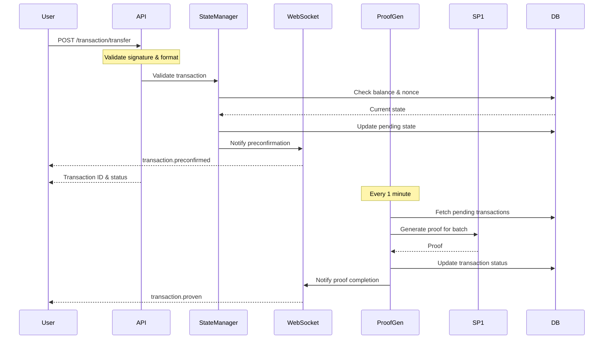
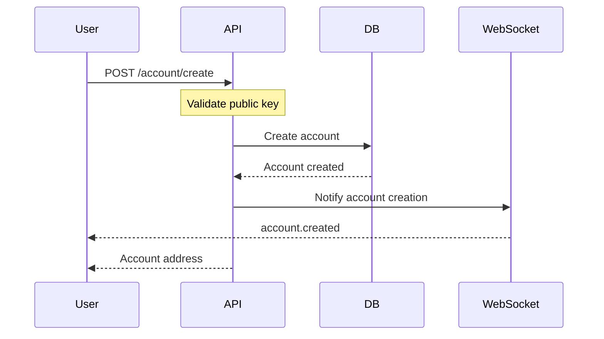
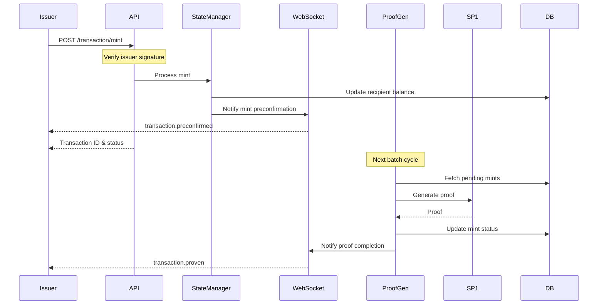
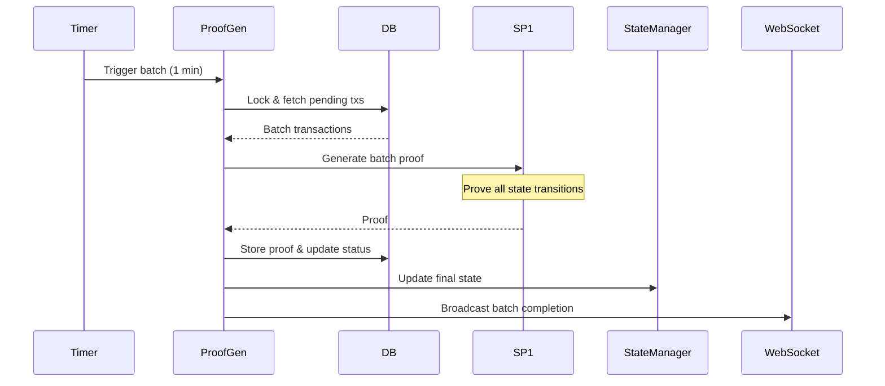

# Sequence Diagrams

## 1. Transfer Transaction Flow

```mermaid
sequenceDiagram
    participant User
    participant API
    participant StateManager
    participant WS as WebSocket
    participant ProofGen
    participant SP1
    participant DB

    User->>API: POST /transaction/transfer
    Note over API: Validate signature & format
    API->>StateManager: Validate transaction
    StateManager->>DB: Check balance & nonce
    DB-->>StateManager: Current state
    StateManager->>DB: Update pending state
    StateManager->>WS: Notify preconfirmation
    WS-->>User: transaction.preconfirmed
    API-->>User: Transaction ID & status

    Note over ProofGen: Every 1 minute
    ProofGen->>DB: Fetch pending transactions
    ProofGen->>SP1: Generate proof for batch
    SP1-->>ProofGen: Proof
    ProofGen->>DB: Update transaction status
    ProofGen->>WS: Notify proof completion
    WS-->>User: transaction.proven
```

## 2. Account Creation Flow

```mermaid
sequenceDiagram
    participant User
    participant API
    participant DB
    participant WS as WebSocket

    User->>API: POST /account/create
    Note over API: Validate public key
    API->>DB: Create account
    DB-->>API: Account created
    API->>WS: Notify account creation
    WS-->>User: account.created
    API-->>User: Account address
```

## 3. Mint Operation Flow

```mermaid
sequenceDiagram
    participant Issuer
    participant API
    participant StateManager
    participant WS as WebSocket
    participant ProofGen
    participant SP1
    participant DB

    Issuer->>API: POST /transaction/mint
    Note over API: Verify issuer signature
    API->>StateManager: Process mint
    StateManager->>DB: Update recipient balance
    StateManager->>WS: Notify mint preconfirmation
    WS-->>Issuer: transaction.preconfirmed
    API-->>Issuer: Transaction ID & status

    Note over ProofGen: Next batch cycle
    ProofGen->>DB: Fetch pending mints
    ProofGen->>SP1: Generate proof
    SP1-->>ProofGen: Proof
    ProofGen->>DB: Update mint status
    ProofGen->>WS: Notify proof completion
    WS-->>Issuer: transaction.proven
```

## 4. Batch Proof Generation Flow

```mermaid
sequenceDiagram
    participant Timer
    participant ProofGen
    participant DB
    participant SP1
    participant StateManager
    participant WS as WebSocket

    Timer->>ProofGen: Trigger batch (1 min)
    ProofGen->>DB: Lock & fetch pending txs
    DB-->>ProofGen: Batch transactions
    ProofGen->>SP1: Generate batch proof
    Note over SP1: Prove all state transitions
    SP1-->>ProofGen: Proof
    ProofGen->>DB: Store proof & update status
    ProofGen->>StateManager: Update final state
    ProofGen->>WS: Broadcast batch completion
```
